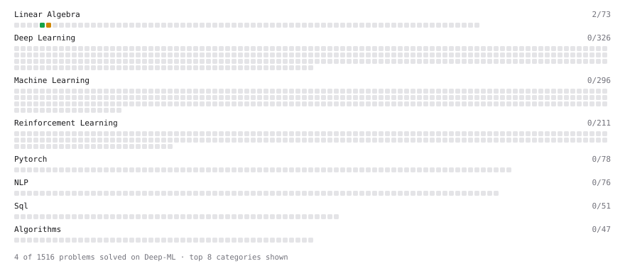

# Deep-ML

My machine learning practice from [Deep-ML](https://www.deep-ml.com). Every solution here was written by hand.

**6** solved · 6 problems · 0 labs · 0 math

[**Browse the interactive portfolio**](https://JesmondLeck.github.io/deep-ml/) to replay this filling in over time.

## Problems

| | Difficulty | Solved | |
| --- | --- | --- | --- |
| [Derivative of a Polynomial](https://www.deep-ml.com/problems/116) | easy | 2026-10-03 | [solution](problems/0116-derivative-of-a-polynomial) |
| [Label Encoding for Ordinal Variables](https://www.deep-ml.com/problems/356) | easy | 2026-10-03 | [solution](problems/0356-label-encoding-for-ordinal-variables) |
| [Min-Max Scaling of Feature Values](https://www.deep-ml.com/problems/112) | easy | 2026-10-03 | [solution](problems/0112-min-max-scaling-of-feature-values) |
| [Scalar Multiplication of a Matrix](https://www.deep-ml.com/problems/5) | easy | 2026-10-03 | [solution](problems/0005-scalar-multiplication-of-a-matrix) |
| [Calculate Eigenvalues of a Matrix](https://www.deep-ml.com/problems/6) | medium | 2026-10-03 | [solution](problems/0006-calculate-eigenvalues-of-a-matrix) |
| [Find Captain Redbeard's Hidden Treasure](https://www.deep-ml.com/problems/127) | medium | 2026-10-03 | [solution](problems/0127-find-captain-redbeard-s-hidden-treasure) |

---

_This file is regenerated by Deep-ML on every push._
